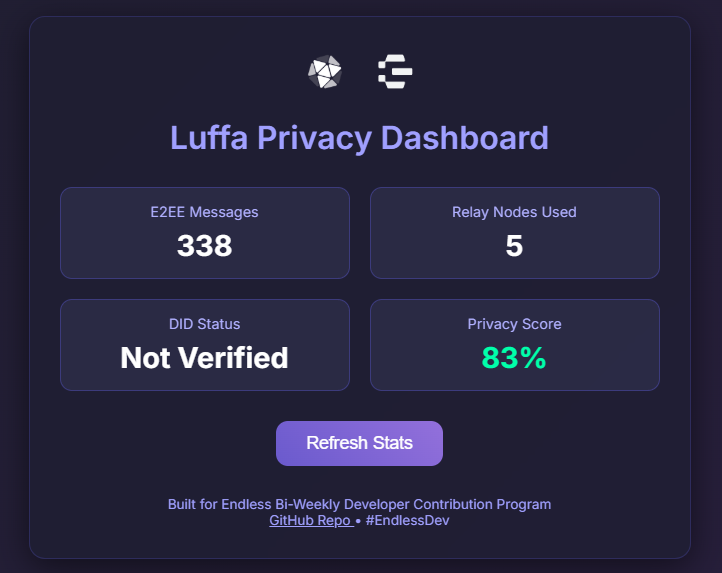

# Luffa Privacy Dashboard Widget

A lightweight, embeddable privacy stats dashboard for Luffa users — built to make privacy visible, tangible, and trustworthy in the Endless ecosystem.



## What It Does
This simple widget displays key privacy metrics for a Luffa user (currently using mock data for demo):
- **E2EE Messages**: Number of end-to-end encrypted messages
- **Relay Nodes Used**: Number of decentralized relay nodes involved
- **DID Status**: Decentralized Identifier verification state
- **Privacy Score**: Overall privacy health score (0–100%, calculated from the metrics above)

## Why It Matters to the Endless Ecosystem
- **Builds user trust**: Most users don't "feel" how strong Luffa’s privacy is — this widget makes it visible and real.
- **Encourages adoption**: Clear privacy feedback motivates users to engage more with privacy-first features.
- **Low-cost, high-impact UX improvement**: Simple tool that boosts retention, word-of-mouth, and ecosystem confidence.
- **Aligns with core values**: Reinforces Endless’s mission of borderless, user-owned privacy.

## Features (MVP)
- Real-time mock stats refresh (click "Refresh Stats")
- Clean, mobile-responsive UI with dark mode Endless aesthetic
- Pure HTML/CSS/JS — no frameworks, easy to embed or extend

## How to Run / Test
1. Clone the repo:
   ```bash
   git clone https://github.com/duchth1993/luffa-privacy-dashboard-widget.git
